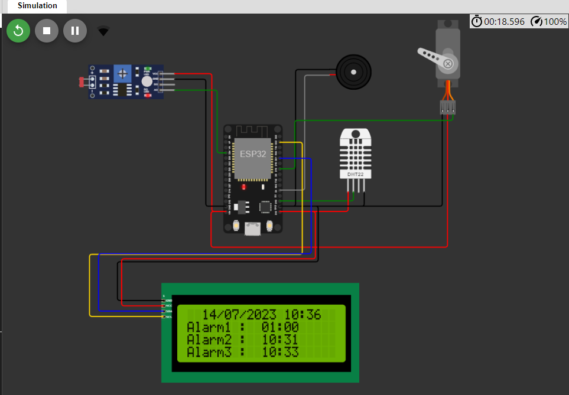
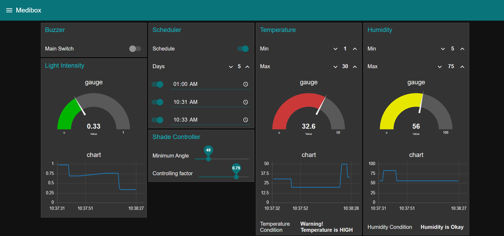
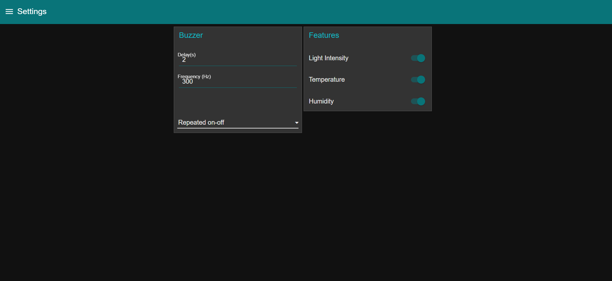

# Medibox
EN3240: Embedded Systems Engineering.  Assignment 2 - IoT project

Medibox is a smart IoT device designed to help users manage their medications effectively.
In this project, medibox is connected to the internet and synchronized with a Node-Red Dashboard. 
ESP32 is used as the medibox controller and is implemented on the WOKWI platform.

# Node-Red Dashboard

